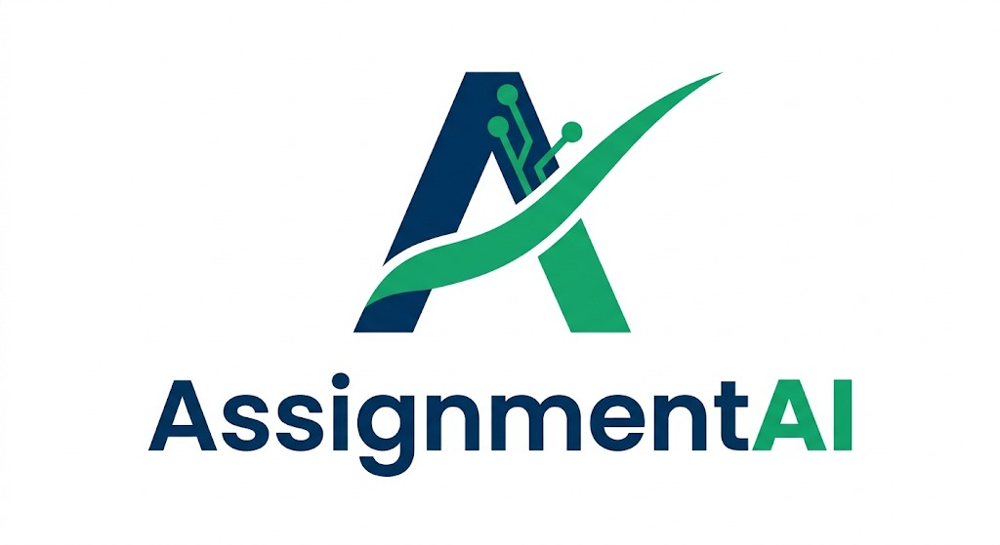

<div align="center">
  
  
  # 🎓 AssignmentAI

  **A Next-Generation AI-Powered Academic Evaluation & Management Platform**

  <p align="center">
    
    
    
    
  </p>

  <p align="center">
    AssignmentAI automates assignment grading, enables real-time AI-driven viva examinations, and provides deep analytics for Admins, Teachers, and Students — unifying modern education into one seamless system.
  </p>
</div>

---

## ✨ Key Features

### 👨‍💼 For Administrators
* **Institute & Department Management**: Manage the structural hierarchy of your organization.
* **User & Role Management**: Maintain secure access control for teachers and students.
* **AI Engine Configuration**: Fine-tune the Grok AI evaluation models, thresholds, and strictness.
* **Global Analytics & Reports**: Monitor the performance of the entire institution from a bird's-eye view.

### 👩‍🏫 For Teachers
* **Smart Deployments**: Create assignments and deploy them with question PDFs and master answer keys.
* **Automated Grading Queue**: Submissions are evaluated asynchronously using a robust BullMQ + Redis queue.
* **Live Viva Examinations**: Schedule and conduct live oral exams with AI evaluating student responses in real-time.
* **Deep Analytics & Annotations**: Review detailed AI rationales, student performance metrics, and handle re-evaluation requests easily.

### 👨‍🎓 For Students
* **Real-time Feedback**: Get instant, detailed AI feedback on written assignments.
* **Interactive Viva Exams**: Participate in secure viva sessions with webcam monitoring and face verification.
* **Performance Tracking**: Monitor academic trajectory through professional trend charts and grades dashboards.
* **Study Resources**: Access materials uploaded by teachers and interact through the platform.

---

## 🏗️ System Architecture

AssignmentAI is built with a highly scalable and decoupled architecture:

```text
AssignmentAI/
├── assignmentai-frontend/   # React + Vite + Tailwind CSS (TypeScript)
├── assignmentai-backend/    # Node.js + Express + Socket.IO
│   └── src/
│       ├── routes/          # RESTful API endpoints
│       ├── services/        # External integrations (Grok AI, Mail, TTS)
│       ├── workers/         # BullMQ async background jobs (Grading)
│       ├── sockets/         # Real-time WebSocket handlers for Live Viva
│       ├── middleware/      # Security, JWT auth, File upload validation
│       └── config/          # Supabase & Database configuration
├── *_migration.sql          # Incremental database schemas
└── vercel.json              # Frontend edge deployment config
```

### 🛠️ Technology Stack

| Category | Technology |
|:---|:---|
| **Frontend** | React 19, Vite, Tailwind CSS, Lucide Icons |
| **Backend** | Node.js, Express 5, Socket.IO |
| **Database & Auth** | Supabase (PostgreSQL), JWT, bcrypt |
| **Storage** | Supabase Buckets (Signed URLs) |
| **AI Evaluation** | Grok API (xAI) |
| **Asynchronous Jobs** | BullMQ + Redis (ioredis) |
| **OCR & Processing** | Tesseract.js, pdf-parse |
| **Security & Verification** | face-api.js (Webcam anti-fraud) |

---

## 🚀 Getting Started

### Prerequisites

Ensure you have the following installed and configured:
- **Node.js** v18+
- **Redis** (Local instance or Cloud provider like Upstash)
- **Supabase** Project (A free tier project is sufficient)
- **xAI API Key** (Obtained from [console.x.ai](https://console.x.ai))

### 1. Database Initialization

1. Navigate to your [Supabase Dashboard](https://supabase.com).
2. Open the **SQL Editor**.
3. Execute the SQL migrations located in the root folder **in the following exact order**:
   * `supabase_migration.sql` *(Core schema)*
   * `assignment_submission_migration.sql`
   * `ai_config_migration.sql`
   * `ai_evaluation_migration.sql`
   * `analytics_migration.sql`
   * `notifications_migration.sql`
   * `platform_settings_migration.sql`
   * `security_logs_migration.sql`
   * `student_requests_migration.sql`
   * `study_materials_migration.sql`
   * `viva_sessions_migration.sql`

### 2. Environment Configuration

Create a `.env` file inside `assignmentai-backend/` with the following variables:

```env
PORT=5000
ALLOWED_ORIGINS=http://localhost:5173,https://your-frontend.vercel.app

# Supabase Configurations
SUPABASE_URL=https://<your-project>.supabase.co
SUPABASE_KEY=<your-anon-public-key>
SUPABASE_SERVICE_ROLE_KEY=<your-service-role-key>

# JWT Authentication
JWT_SECRET=<your-strong-secret-key>

# Redis Queue
REDIS_URL=redis://localhost:6379

# xAI Grok API
GROK_API_KEY=<your-grok-api-key>

# SMTP (Optional - For Emails)
SMTP_HOST=smtp.gmail.com
SMTP_PORT=587
SMTP_USER=<your-email@gmail.com>
SMTP_PASS=<your-app-password>
SMTP_FROM_EMAIL=<your-email@gmail.com>
```

### 3. Running the Application

**Start the Backend Server:**
```bash
cd assignmentai-backend
npm install
npm run dev
```
*(Server will launch on `http://localhost:5000`)*

**Start the Frontend Client:**
```bash
cd assignmentai-frontend
npm install
npm run dev
```
*(Application will launch on `http://localhost:5173`)*

---

## ☁️ Deployment

* **Frontend**: Optimized for Vercel deployment. The `vercel.json` file in the root is pre-configured. Remember to set `VITE_API_URL` in Vercel to point to your backend.
* **Backend**: Can be deployed to Render, Railway, or Fly.io. Ensure the `REDIS_URL` environment variable points to a production Redis instance.

---

## 🤝 Acknowledgements

We extend our sincere gratitude to our mentors for their expert guidance, continuous support, and invaluable insights throughout the development of this platform:

* **Manan D. Thakker**
* **Hiten M. Sadani**

Their technical expertise and mentorship were instrumental in shaping AssignmentAI.

---

<div align="center">
  <p>Released under the <strong>ISC License</strong>.</p>
  <p>Built with ❤️ using React, Express, Supabase, and Grok AI.</p>
</div>
